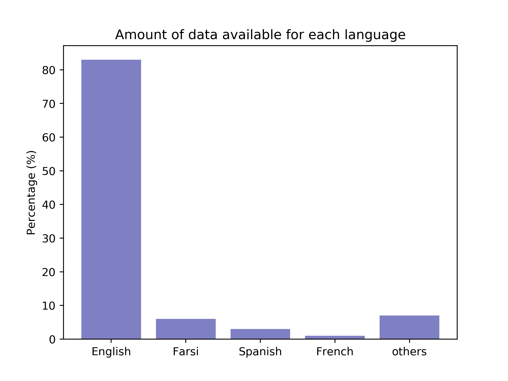
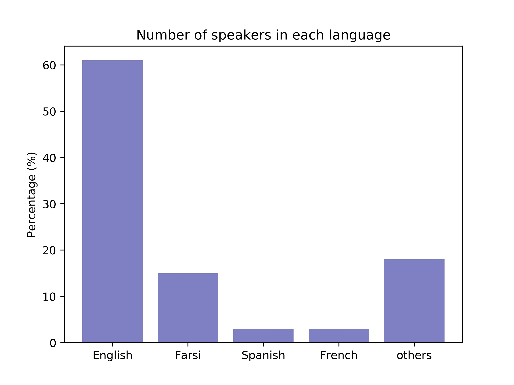

# JSPEECH: A Multi-Lingual Conversational Speech Corpus
This corpus contains 1332 hours of conversational speech
from 47 different languages. This corpus can be used in a
variety of studies, created from 106 public chat group the
effect of language variability on the performance of speaker
recognition systems and automatic language detection.

It is uploaded in google drive and you can download 
 it after completing the Letter of Consent  [here](https://raw.githubusercontent.com/ajanaliz/important-documents/29dab4024575b73a9a3accc3e45645b3a3941054/Letter%20of%20Consent%20for%20JSPEECH.pdf), and send it to ali.janalizadeh@outlook.com.

## JSpeech Description


JSpeech contains up to
452,007 audio messages scraped from public groups, comprising
a total of 1332 hours of converational audio data.
The discussions in these groups are unstructured and are
conducted with multiple speakers. JSpeech is a multilingual
corpus with audio speech data from 47 different languages
with over 12140 different speakers. The most notable feature
of this audio data is the presence of different uncontrolled
environments surrounding the speakers. This is useful in the
development of speech technologies that are robust to different
kinds of background noise.


JSpeech is a multilingual speech corpus consisting of roughly
900 gigabytes of WAV files. Metadata of each file is stored in
an SQLite database.

If you want to convert the WAV files, you can use ffmpeg:

``` 
sudo apt-get install ffmpeg
ffmpeg -i audio.ogg audio.wav
```


In order to ensure the diversity and adequacy of the corpus,
a set of 106 group chats from different backgrounds
and languages were scraped from the public groups of the [Telegram](https://telegram.org/)
messaging application. Each voice message has 6
fields which are described in Table belwo.


|   Field Name    |                     Description                      |
| :-------------: | :--------------------------------------------------: |
|    Voice_id     |       Unique ID assigned to each voice message       |
|     User_id     |          Unique ID assigned to each speaker          |
|    Fwd_from     | ID of user that this message has been forwarded from |
| Reply_to_msg_id |    ID of the message this message was replied to     |
|      Date       |              Time stamp of each message              |
|      Size       |           Size of the voice message (byte)           |
|    Duration     |        Duration of the voice message (second)        |
|    Chat_name    |                      Group name                      |

As shown in the barchart, the majority of the voice
messages are made up of speech spoken in English, but there
is also a noticeable amount of audio data available in other
languages like Farsi, Spanish, and French.

 

In addition, you can find the 
distribution of the number of speakers available for each language.




If you want to know more information about JSpeech, you can read the paper [here](https://www.researchgate.net/profile/Saeid_Safavi/publication/328956407_JSPEECH_A_MULTI-LINGUAL_CONVERSATIONAL_SPEECH_CORPUS/links/5bed31e9299bf1124fd38e31/JSPEECH-A-MULTI-LINGUAL-CONVERSATIONAL-SPEECH-CORPUS.pdf). 


## Corpus Applications
It is expected that with the availability of multilingual speech
corpora with different setups of background environments
will improve and boost R&D in the field of automatic speaker
recognition and voice activity detection.

At [Miras Technologies International](http://miras-tech.com)  we are using JSpeech to 
develop Speaker and Speech Recognition Systems.


## Cite
Please cite the following paper in your publication if you are using JSpeech in your research:
```bibtex
@article{choobbastijspeech,
  title={JSPEECH: A MULTI-LINGUAL CONVERSATIONAL SPEECH CORPUS},
  author={Choobbasti, Ali Janalizadeh and Gholamian, Mohammad Erfan and Vaheb, Amir and Safavi, Saeid}
}
  ```
  

